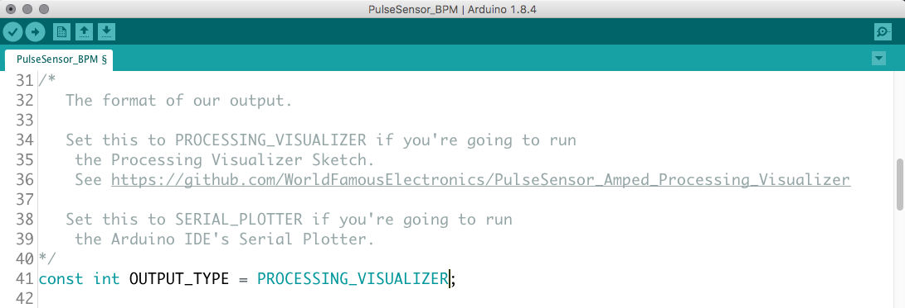

## <a href="https://processing.org"> Processing</a> Visualization & <a href="http://www.pulsesensor.com">PulseSensor</a>

## Upload Arduino Sketch To Your Microcontroller
Before running this program, you have to upload our Pulse Sensor Arduino Sketch to your Arduino board of choice. For details on how to do that, go [here](https://github.com/WorldFamousElectronics/PulseSensor_Amped_Arduino), and follow the `READ_ME` tutorial. In order for your Arduino board to talk to the Pulse Sensor Amped Visualizer, you will need to change a variable in the Arduino code. The variable is called `outputType`, and by default it is set to `SERIAL_PLOTTER`. You need to change it to `PROCESSING_VISUALIZER`. To make this change, go to the main tab of the Arduino Sketch, and change the variable declairation on line 37 as shown below.

Then, upload the Arduino Sketch and your board is ready to send data the way our Processing Visualizer likes to get it!

## Installation
1.  Click the `Clone or Download` button above and download the zip, or if you are a github user, clone this repo, or fork it!
2.  Unzip the download, and take the folder called `PulseSensorAmpd_Processing_150` and place it in your `Documents/Processing` folder.
3.  Then open or restart Processing to access the code through your Sketch folder. Select `File > Sketchbook...`

Then select `PulseSensorAmped_Processing_Visualizer`

The Sketch will launch, and you will be prompted to select the USB port associated with your Arduino board. The list of available ports with auto-update when you plug/unplug USB cables. Use the `Refresh Serial Ports` button to update the ports list if you don't see your Arduino. **Usually**, your Arduino port is at the top of the list! You can also make a note of the port that you used to upload your code in Arduino, since it's the same one. Once you select the right port, you will start seeing hearbeat data!

There are a couple of cool things you can do while the sketch is running:

* Press 's' or 'S' to take a screenshot of the program window
  * The image will be saved in the sketch folder as a .jpg
* Press 'r' or 'R' to reset the data windows to zero
